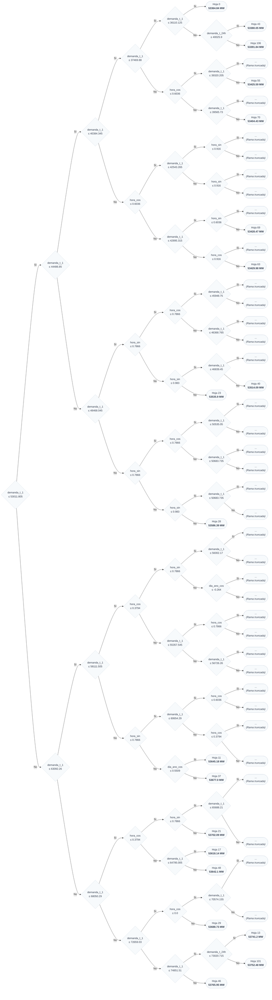

%% CÓDIGO MERMAID GENERADO PARA EL ÁRBOL 0 %%

```mermaid
graph LR
    %% Definición de estilos de nodos
    classDef default fill:#f7fafc,stroke:#cbd5e0,stroke-width:1px,color:#2d3748;
    classDef leaf fill:#e6fffa,stroke:#b2f5ea,stroke-width:2px,color:#234e52;
    N0{"demanda_t_1<br>&le; 53011.805"}
    N2{"demanda_t_1<br>&le; 44486.85"}
    N6{"demanda_t_1<br>&le; 40384.345"}
    N17{"demanda_t_1<br>&le; 37469.88"}
    N42{"demanda_t_1<br>&le; 36110.125"}
    L0(["Hoja 0<br><b>53364.84 MW</b>"])
    N42 -->|Sí| L0
    N105{"demanda_t_24h<br>&le; 40025.9"}
    L43(["Hoja 43<br><b>53380.05 MW</b>"])
    N105 -->|Sí| L43
    L106(["Hoja 106<br><b>53391.84 MW</b>"])
    N105 -->|No| L106
    N42 -->|No| N105
    N17 -->|Sí| N42
    N32{"hora_cos<br>&le; 0.6036"}
    N54{"demanda_t_1<br>&le; 39320.205"}
    T112_6(["...<br><i>(Rama truncada)</i>"])
    N54 -->|Sí| T112_6
    L55(["Hoja 55<br><b>53425.59 MW</b>"])
    N54 -->|No| L55
    N32 -->|Sí| N54
    N69{"demanda_t_1<br>&le; 39565.73"}
    T122_6(["...<br><i>(Rama truncada)</i>"])
    N69 -->|Sí| T122_6
    L70(["Hoja 70<br><b>53404.43 MW</b>"])
    N69 -->|No| L70
    N32 -->|No| N69
    N17 -->|No| N32
    N6 -->|Sí| N17
    N13{"hora_cos<br>&le; 0.6036"}
    N24{"demanda_t_1<br>&le; 42543.265"}
    N56{"hora_sin<br>&le; 0.916"}
    T64_6(["...<br><i>(Rama truncada)</i>"])
    N56 -->|Sí| T64_6
    T75_6(["...<br><i>(Rama truncada)</i>"])
    N56 -->|No| T75_6
    N24 -->|Sí| N56
    N30{"hora_sin<br>&le; 0.916"}
    T70_6(["...<br><i>(Rama truncada)</i>"])
    N30 -->|Sí| T70_6
    T44_6(["...<br><i>(Rama truncada)</i>"])
    N30 -->|No| T44_6
    N24 -->|No| N30
    N13 -->|Sí| N24
    N33{"demanda_t_1<br>&le; 42895.315"}
    N68{"hora_sin<br>&le; 0.6036"}
    T81_6(["...<br><i>(Rama truncada)</i>"])
    N68 -->|Sí| T81_6
    L69(["Hoja 69<br><b>53428.47 MW</b>"])
    N68 -->|No| L69
    N33 -->|Sí| N68
    N62{"hora_cos<br>&le; 0.916"}
    T119_6(["...<br><i>(Rama truncada)</i>"])
    N62 -->|Sí| T119_6
    L63(["Hoja 63<br><b>53429.98 MW</b>"])
    N62 -->|No| L63
    N33 -->|No| N62
    N13 -->|No| N33
    N6 -->|No| N13
    N2 -->|Sí| N6
    N5{"demanda_t_1<br>&le; 48468.045"}
    N9{"hora_sin<br>&le; 0.7866"}
    N19{"hora_cos<br>&le; 0.7866"}
    N34{"demanda_t_1<br>&le; 45948.75"}
    T102_6(["...<br><i>(Rama truncada)</i>"])
    N34 -->|Sí| T102_6
    T60_6(["...<br><i>(Rama truncada)</i>"])
    N34 -->|No| T60_6
    N19 -->|Sí| N34
    N40{"demanda_t_1<br>&le; 46368.765"}
    T80_6(["...<br><i>(Rama truncada)</i>"])
    N40 -->|Sí| T80_6
    T67_6(["...<br><i>(Rama truncada)</i>"])
    N40 -->|No| T67_6
    N19 -->|No| N40
    N9 -->|Sí| N19
    N22{"hora_sin<br>&le; 0.983"}
    N39{"demanda_t_1<br>&le; 46839.45"}
    T77_6(["...<br><i>(Rama truncada)</i>"])
    N39 -->|Sí| T77_6
    L40(["Hoja 40<br><b>53514.09 MW</b>"])
    N39 -->|No| L40
    N22 -->|Sí| N39
    L23(["Hoja 23<br><b>53535.9 MW</b>"])
    N22 -->|No| L23
    N9 -->|No| N22
    N5 -->|Sí| N9
    N7{"hora_sin<br>&le; 0.7866"}
    N15{"hora_cos<br>&le; 0.7866"}
    N26{"demanda_t_1<br>&le; 50535.05"}
    T58_6(["...<br><i>(Rama truncada)</i>"])
    N26 -->|Sí| T58_6
    T50_6(["...<br><i>(Rama truncada)</i>"])
    N26 -->|No| T50_6
    N15 -->|Sí| N26
    N31{"demanda_t_1<br>&le; 50683.735"}
    T72_6(["...<br><i>(Rama truncada)</i>"])
    N31 -->|Sí| T72_6
    T71_6(["...<br><i>(Rama truncada)</i>"])
    N31 -->|No| T71_6
    N15 -->|No| N31
    N7 -->|Sí| N15
    N27{"hora_sin<br>&le; 0.983"}
    N37{"demanda_t_1<br>&le; 50683.735"}
    T85_6(["...<br><i>(Rama truncada)</i>"])
    N37 -->|Sí| T85_6
    T59_6(["...<br><i>(Rama truncada)</i>"])
    N37 -->|No| T59_6
    N27 -->|Sí| N37
    L28(["Hoja 28<br><b>53586.39 MW</b>"])
    N27 -->|No| L28
    N7 -->|No| N27
    N5 -->|No| N7
    N2 -->|No| N5
    N0 -->|Sí| N2
    N1{"demanda_t_1<br>&le; 63092.26"}
    N3{"demanda_t_1<br>&le; 58111.505"}
    N8{"hora_cos<br>&le; 0.3794"}
    N11{"hora_sin<br>&le; 0.7866"}
    N18{"demanda_t_1<br>&le; 56002.17"}
    T43_6(["...<br><i>(Rama truncada)</i>"])
    N18 -->|Sí| T43_6
    T49_6(["...<br><i>(Rama truncada)</i>"])
    N18 -->|No| T49_6
    N11 -->|Sí| N18
    N38{"dia_ano_cos<br>&le; -0.264"}
    T88_6(["...<br><i>(Rama truncada)</i>"])
    N38 -->|Sí| T88_6
    T53_6(["...<br><i>(Rama truncada)</i>"])
    N38 -->|No| T53_6
    N11 -->|No| N38
    N8 -->|Sí| N11
    N29{"demanda_t_1<br>&le; 55357.545"}
    N52{"hora_cos<br>&le; 0.7866"}
    T97_6(["...<br><i>(Rama truncada)</i>"])
    N52 -->|Sí| T97_6
    T106_6(["...<br><i>(Rama truncada)</i>"])
    N52 -->|No| T106_6
    N29 -->|Sí| N52
    N63{"demanda_t_1<br>&le; 56726.26"}
    T82_6(["...<br><i>(Rama truncada)</i>"])
    N63 -->|Sí| T82_6
    T123_6(["...<br><i>(Rama truncada)</i>"])
    N63 -->|No| T123_6
    N29 -->|No| N63
    N8 -->|No| N29
    N3 -->|Sí| N8
    N10{"hora_sin<br>&le; 0.7866"}
    N14{"demanda_t_1<br>&le; 60654.29"}
    N21{"hora_cos<br>&le; 0.6036"}
    T46_6(["...<br><i>(Rama truncada)</i>"])
    N21 -->|Sí| T46_6
    T107_6(["...<br><i>(Rama truncada)</i>"])
    N21 -->|No| T107_6
    N14 -->|Sí| N21
    N25{"hora_cos<br>&le; 0.3794"}
    T41_6(["...<br><i>(Rama truncada)</i>"])
    N25 -->|Sí| T41_6
    T99_6(["...<br><i>(Rama truncada)</i>"])
    N25 -->|No| T99_6
    N14 -->|No| N25
    N10 -->|Sí| N14
    N36{"dia_ano_cos<br>&le; 0.5509"}
    L11(["Hoja 11<br><b>53645.18 MW</b>"])
    N36 -->|Sí| L11
    L37(["Hoja 37<br><b>53677.0 MW</b>"])
    N36 -->|No| L37
    N10 -->|No| N36
    N3 -->|No| N10
    N1 -->|Sí| N3
    N4{"demanda_t_1<br>&le; 68050.29"}
    N16{"hora_cos<br>&le; 0.3794"}
    N20{"hora_sin<br>&le; 0.7866"}
    N23{"demanda_t_1<br>&le; 65688.21"}
    T57_6(["...<br><i>(Rama truncada)</i>"])
    N23 -->|Sí| T57_6
    T61_6(["...<br><i>(Rama truncada)</i>"])
    N23 -->|No| T61_6
    N20 -->|Sí| N23
    L21(["Hoja 21<br><b>53702.09 MW</b>"])
    N20 -->|No| L21
    N16 -->|Sí| N20
    N47{"demanda_t_1<br>&le; 64795.005"}
    L17(["Hoja 17<br><b>53618.14 MW</b>"])
    N47 -->|Sí| L17
    L48(["Hoja 48<br><b>53642.1 MW</b>"])
    N47 -->|No| L48
    N16 -->|No| N47
    N4 -->|Sí| N16
    N12{"demanda_t_1<br>&le; 72659.03"}
    N28{"hora_cos<br>&le; 0.0"}
    N35{"demanda_t_1<br>&le; 70574.155"}
    T48_6(["...<br><i>(Rama truncada)</i>"])
    N35 -->|Sí| T48_6
    T51_6(["...<br><i>(Rama truncada)</i>"])
    N35 -->|No| T51_6
    N28 -->|Sí| N35
    L29(["Hoja 29<br><b>53688.73 MW</b>"])
    N28 -->|No| L29
    N12 -->|Sí| N28
    N45{"demanda_t_1<br>&le; 74851.51"}
    N100{"demanda_t_24h<br>&le; 73020.715"}
    L13(["Hoja 13<br><b>53741.2 MW</b>"])
    N100 -->|Sí| L13
    L101(["Hoja 101<br><b>53752.48 MW</b>"])
    N100 -->|No| L101
    N45 -->|Sí| N100
    L46(["Hoja 46<br><b>53765.95 MW</b>"])
    N45 -->|No| L46
    N12 -->|No| N45
    N4 -->|No| N12
    N1 -->|No| N4
    N0 -->|No| N1
    class L* leaf;
```
